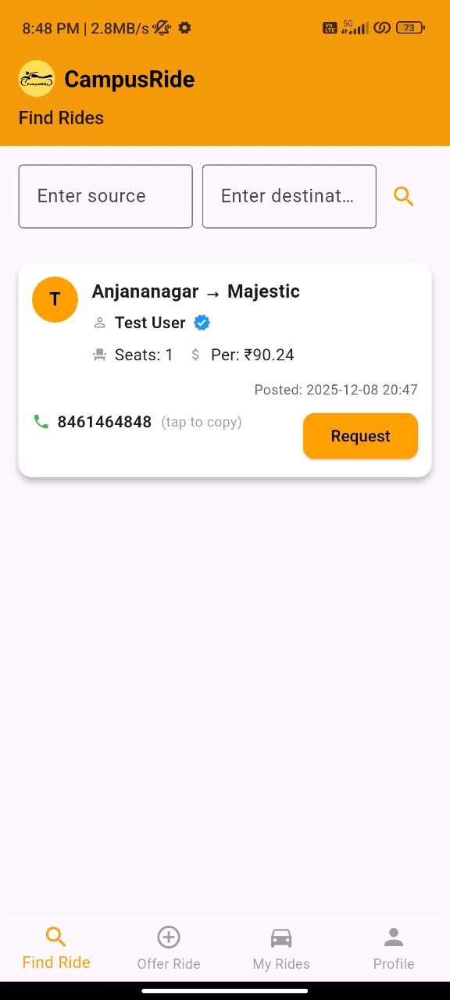
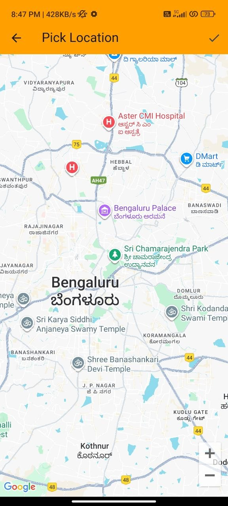
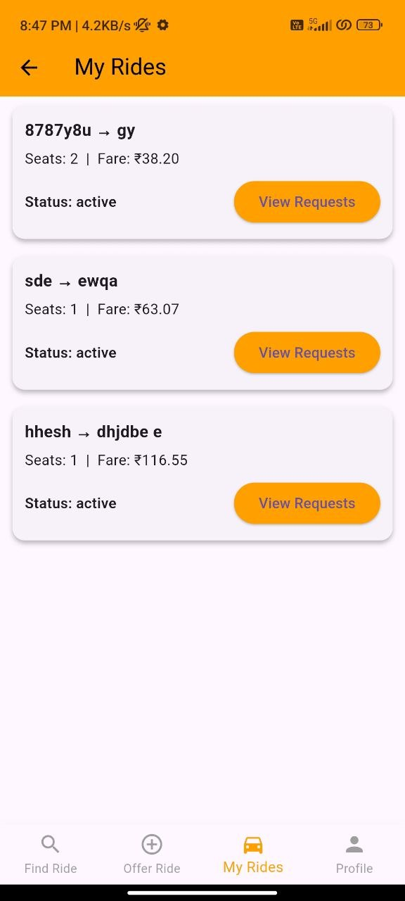
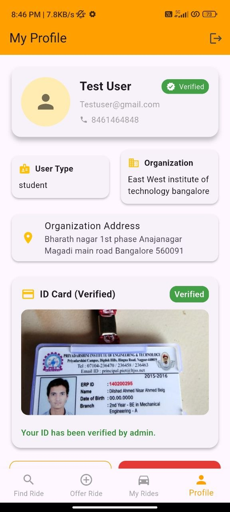
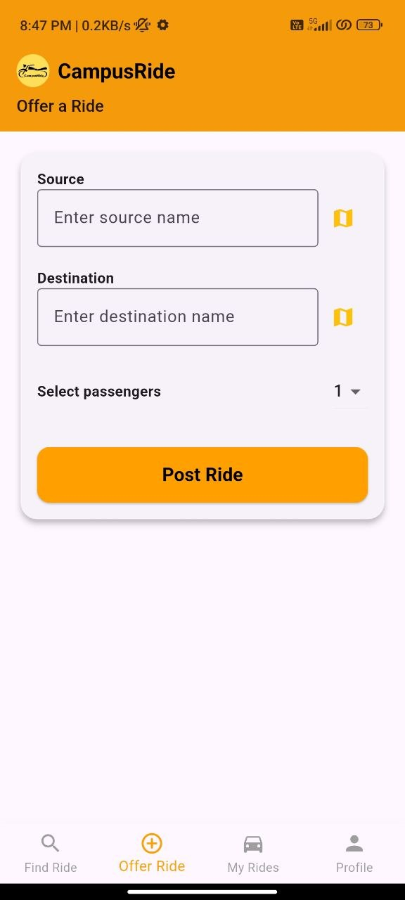
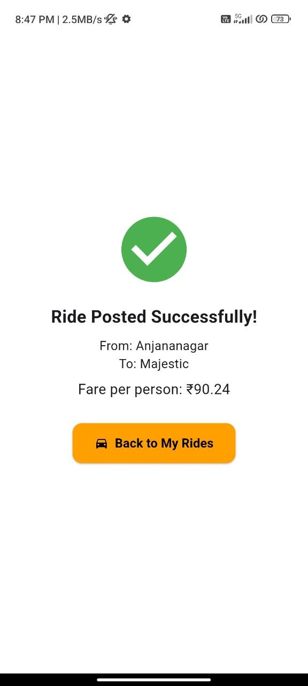

# 🚗 CampusRide — Campus Ride-Sharing Application

<p align="center">
  
</p>

<h3 align="center">A Smart & Affordable Ride-Sharing Platform for Students</h3>

<p align="center">
  CampusRide connects students who are travelling on similar routes, making campus transportation more affordable, convenient, and collaborative.
</p>

<p align="center">
  
  
  
  
  
</p>

---

## 📌 About the Project

**CampusRide** is a Flutter-based campus ride-sharing application designed specifically to simplify transportation for students.

Students can either **offer a ride** when they are travelling somewhere or **find an available ride** from another user travelling on a similar route.

The application combines:

* 🔐 Firebase Authentication
* ☁️ Cloud Firestore
* 🗺️ Google Maps
* 📍 Location services
* 💰 Distance-based fare calculation
* 👥 Passenger management
* 📩 Ride requests
* 👤 Student profiles
* 🪪 Student ID verification
* 🔎 Ride searching and filtering

The main objective is to create a trusted and affordable transportation ecosystem within a student community.

---

# ✨ Features

## 🔐 User Authentication

CampusRide provides user authentication using **Firebase Authentication**.

Users can:

* Create an account
* Log in securely
* Maintain their profile
* Log out of the application

---

## 🔎 Find a Ride

Students can search for available rides using:

* Source
* Destination

Available rides display information such as:

* Driver/user
* Source
* Destination
* Available passengers
* Total fare
* Fare per person
* Ride posting information
* Request option

The application retrieves recent ride information from Cloud Firestore.

---

## 🚗 Offer a Ride

Users can offer their own ride by entering:

* 📍 Source
* 📍 Destination
* 👥 Number of passengers

The application calculates the estimated fare and displays the amount before the ride is posted.

### Example

```text
Total Fare: ₹90.24
Per Person: ₹90.24
```

Once the ride is successfully submitted, the application displays a confirmation screen.

---

## 📍 Interactive Map Location Picker

CampusRide integrates **Google Maps** to allow users to select locations directly from a map.

Users can select:

* Pickup location
* Destination location

The selected latitude and longitude are used for distance and fare calculations.

<p align="center">
  
</p>

---

## 💰 Distance-Based Fare Calculation

CampusRide calculates the approximate fare using the distance between the selected source and destination.

The application uses the **Haversine formula** to calculate the geographical distance between two coordinates.

### Fare Formula

```text
Fare = Base Fare + (Distance × Per KM Fare)
```

Current implementation:

```text
Base Fare  = ₹20
Per KM     = ₹10
```

The calculated fare is then divided according to the selected passenger count to determine the fare per person.

---

## 👥 Passenger Selection

When offering a ride, users can select the number of passengers.

The application supports passenger selection and automatically updates the fare per person.

---

## 📩 Ride Requests

Students can request available rides.

Ride providers can view incoming requests from the:

**My Rides → View Requests**

section.

This allows ride providers to manage requests associated with their posted rides.

---

## 🚘 My Rides

The **My Rides** section allows users to view rides they have offered.

Ride information includes:

* Source
* Destination
* Passenger count
* Total fare
* Fare per person
* Ride status
* Posted date/time
* Incoming requests

<p align="center">
  
</p>

---

## 👤 Student Profile

Each user has a dedicated profile containing:

* Name
* Email
* Phone number
* User type
* Organization
* Organization address
* Verification status
* Student ID information

<p align="center">
  
</p>

---

## 🪪 Student ID Verification

CampusRide includes student identity verification to improve trust within the platform.

Users can upload their student ID and the profile displays the verification status.

This feature is intended to help create a safer campus ride-sharing environment.

> **Note:** For a public GitHub repository, screenshots containing real ID cards, phone numbers, emails, or other personal information should be replaced with dummy/test information.

---

# 📱 Application Screenshots

## 🔎 Find Ride

Search for rides by entering the source and destination.

<p align="center">
  
</p>

---

## 🚗 Offer Ride

Offer a ride by selecting the source, destination, and number of passengers.

<p align="center">
  
</p>

---

## 📍 Pick Location

Select source or destination using the interactive Google Maps interface.

<p align="center">
  
</p>

---

## ✅ Ride Posted Successfully

After successfully posting a ride, users receive a confirmation screen showing the fare per person.

<p align="center">
  
</p>

---

## 🚘 My Rides

View previously offered rides and access incoming ride requests.

<p align="center">
  
</p>

---

## 👤 Profile & Verification

View personal information, organization details, and student verification status.

<p align="center">
  
</p>

---

# 🔄 Application Workflow

```text
                     ┌──────────────────┐
                     │      User        │
                     └────────┬─────────┘
                              │
                              ▼
                     ┌──────────────────┐
                     │ Authentication   │
                     │ Firebase Auth    │
                     └────────┬─────────┘
                              │
                              ▼
                     ┌──────────────────┐
                     │   CampusRide     │
                     │    Home          │
                     └────────┬─────────┘
                              │
                    ┌─────────┴─────────┐
                    │                   │
                    ▼                   ▼
             ┌─────────────┐     ┌─────────────┐
             │  Find Ride  │     │  Offer Ride │
             └──────┬──────┘     └──────┬──────┘
                    │                   │
                    ▼                   ▼
             ┌─────────────┐     ┌─────────────┐
             │ Search Ride │     │ Pick Source │
             │   Results   │     │ & Destination│
             └──────┬──────┘     └──────┬──────┘
                    │                   │
                    ▼                   ▼
             ┌─────────────┐     ┌─────────────┐
             │Request Ride │     │Google Maps  │
             └─────────────┘     └──────┬──────┘
                                        │
                                        ▼
                                 ┌─────────────┐
                                 │ Calculate   │
                                 │    Fare     │
                                 └──────┬──────┘
                                        │
                                        ▼
                                 ┌─────────────┐
                                 │  Post Ride  │
                                 └──────┬──────┘
                                        │
                                        ▼
                                 ┌─────────────┐
                                 │  My Rides   │
                                 └──────┬──────┘
                                        │
                                        ▼
                                 ┌─────────────┐
                                 │   Requests  │
                                 └─────────────┘
```

---

# 🏗️ System Architecture

```text
┌───────────────────────────────────────────────┐
│                 Flutter App                   │
│                                               │
│  ┌─────────┐ ┌───────────┐ ┌──────────────┐ │
│  │ Login / │ │ Find Ride │ │ Offer Ride   │ │
│  │ Register│ │           │ │              │ │
│  └────┬────┘ └─────┬─────┘ └──────┬───────┘ │
│       │            │              │          │
│       └────────────┼──────────────┘          │
│                    │                         │
│             ┌──────▼──────┐                  │
│             │   Services  │                  │
│             │   & Utils   │                  │
│             └──────┬──────┘                  │
└────────────────────┼─────────────────────────┘
                     │
          ┌──────────┼───────────┐
          │          │           │
          ▼          ▼           ▼
   ┌────────────┐ ┌────────┐ ┌──────────────┐
   │ Firebase   │ │Google  │ │  Location    │
   │ Auth       │ │ Maps   │ │  Services    │
   └────────────┘ └────────┘ └──────────────┘
          │
          ▼
   ┌────────────────────┐
   │ Cloud Firestore    │
   │                    │
   │ Users              │
   │ Rides              │
   │ Requests           │
   │ Verification Data  │
   └────────────────────┘
```

---

# 🛠️ Technology Stack

| Technology                  | Purpose                                     |
| --------------------------- | ------------------------------------------- |
| **Flutter**                 | Cross-platform mobile application framework |
| **Dart**                    | Application programming language            |
| **Firebase Authentication** | User registration and login                 |
| **Cloud Firestore**         | Users, rides and request data               |
| **Firebase Storage**        | File/image storage                          |
| **Google Maps Flutter**     | Interactive maps                            |
| **Geolocator**              | Device location services                    |
| **Location**                | Location access                             |
| **Geocoding**               | Location/address conversion                 |
| **Dart Geohash**            | Geographic location indexing                |
| **HTTP**                    | Network/API communication                   |
| **Image Picker**            | Selecting ID/profile images                 |
| **File Picker**             | Selecting files                             |
| **Flutter TypeAhead**       | Location/search suggestions                 |
| **Intl**                    | Date/time and formatting                    |

---

# 📦 Main Dependencies

The project uses several Flutter packages including:

```yaml
firebase_core
firebase_auth
cloud_firestore
firebase_storage
google_maps_flutter
geolocator
geocoding
location
dart_geohash
image_picker
file_picker
flutter_typeahead
flutter_keyboard_visibility
intl
http
flutter_spinkit
```

---

# 📂 Project Structure

```text
CampusRide/
│
├── android/
├── ios/
├── linux/
├── macos/
├── web/
├── windows/
│
├── lib/
│   │
│   ├── data/
│   │   ├── ride_data.dart
│   │   └── user_data.dart
│   │
│   ├── screens/
│   │   ├── find_ride_screen.dart
│   │   ├── home_screen.dart
│   │   ├── login_screen.dart
│   │   ├── map_picker_screen.dart
│   │   ├── my_rides_screen.dart
│   │   ├── offer_ride_screen.dart
│   │   ├── profile_screen.dart
│   │   ├── register_screen.dart
│   │   ├── requests_screen.dart
│   │   └── ride_success_screen.dart
│   │
│   ├── services/
│   │   └── ride_service.dart
│   │
│   ├── utils/
│   │   ├── fare_calculator.dart
│   │   └── migrate_users.dart
│   │
│   ├── main.dart
│   └── update_rides_geohash.dart
│
├── test/
│
├── pubspec.yaml
├── pubspec.lock
├── analysis_options.yaml
├── .gitignore
└── README.md
```

---

# ⚙️ Getting Started

## Prerequisites

Make sure you have the following installed:

* [Flutter SDK](https://docs.flutter.dev/get-started/install)
* Dart SDK
* Android Studio
* VS Code (recommended)
* Android Emulator or physical Android device
* Firebase project
* Google Maps API configuration

Check your Flutter installation:

```bash
flutter doctor
```

---

# 📥 Installation

### 1. Clone the repository

```bash
git clone YOUR_GITHUB_REPOSITORY_URL
```

### 2. Navigate to the project

```bash
cd CampusRide
```

### 3. Install Flutter dependencies

```bash
flutter pub get
```

### 4. Configure Firebase

Create/configure a Firebase project and connect it with the Flutter application.

Required Firebase services include:

* Firebase Authentication
* Cloud Firestore
* Firebase Storage

Configure the appropriate Android/iOS Firebase configuration files for your environment.

### 5. Configure Google Maps

Create a Google Maps API key and configure it for the Android/iOS application according to the Google Maps Flutter setup requirements.

### 6. Run the application

```bash
flutter run
```

---

# 📱 Build APK

To generate a release APK:

```bash
flutter build apk --release
```

The APK will be generated under:

```text
build/app/outputs/flutter-apk/
```

---

# 🔐 Security Notes

If you publish this repository publicly:

* Do not commit passwords or private credentials.
* Do not upload personal student ID cards.
* Do not expose private user information in screenshots.
* Restrict Google Maps API keys to the required applications.
* Configure Firebase security rules appropriately.
* Use test/dummy user information for demonstrations.

---

# 🎯 Project Objectives

CampusRide was developed with the following objectives:

1. 🚗 Make student transportation easier.
2. 💰 Reduce individual transportation costs.
3. 👥 Encourage students to share rides.
4. 📍 Simplify pickup and destination selection.
5. 🔎 Make finding available rides easier.
6. 🔐 Improve trust through student verification.
7. 📩 Provide a simple ride-request mechanism.
8. 🗺️ Use location technology for smarter ride sharing.

---

# 🌱 Potential Impact

CampusRide can help create a more efficient campus transportation system by encouraging students travelling along similar routes to share rides.

Potential benefits include:

* Reduced travel costs
* Better vehicle utilization
* Reduced traffic
* Lower fuel consumption
* Reduced environmental impact
* Improved student mobility
* Greater connectivity between students

---

# 🚀 Future Enhancements

Future versions of CampusRide could include:

* 💬 In-app rider/driver chat
* 🔔 Push notifications
* ⭐ Rider and driver ratings
* 🧭 Real-time ride tracking
* 💳 Online payment integration
* 🚨 Emergency/SOS functionality
* 📊 Ride statistics and analytics
* 🔄 Ride cancellation management
* 🏫 College/campus-specific communities
* 🤖 Smart ride matching
* 🕐 Scheduled rides
* 🔔 Automatic ride reminders
* 🛡️ Enhanced identity verification

---

# 🧪 Testing

Flutter's testing framework can be used to run the project's tests.

Run:

```bash
flutter test
```

---

# 📊 Project Highlights

| Category          | Implementation             |
| ----------------- | -------------------------- |
| Application       | Campus Ride Sharing        |
| Framework         | Flutter                    |
| Language          | Dart                       |
| Authentication    | Firebase Authentication    |
| Database          | Cloud Firestore            |
| Storage           | Firebase Storage           |
| Maps              | Google Maps                |
| Location          | Geolocator + Location      |
| Fare Calculation  | Haversine Distance Formula |
| User Verification | Student ID Verification    |
| Ride Management   | Firestore                  |
| Platform          | Android / iOS              |

---

# 👨‍💻 Developer

### Vikesh

**CampusRide — Campus Ride-Sharing Application**

Built using **Flutter, Dart, Firebase and Google Maps**.

---

# ⭐ Support the Project

If you find CampusRide useful or interesting, consider giving this repository a ⭐ on GitHub.

---

## 📄 License

This project is currently intended for educational and academic purposes.

If you plan to distribute or modify the project publicly, add an appropriate open-source license such as MIT.
